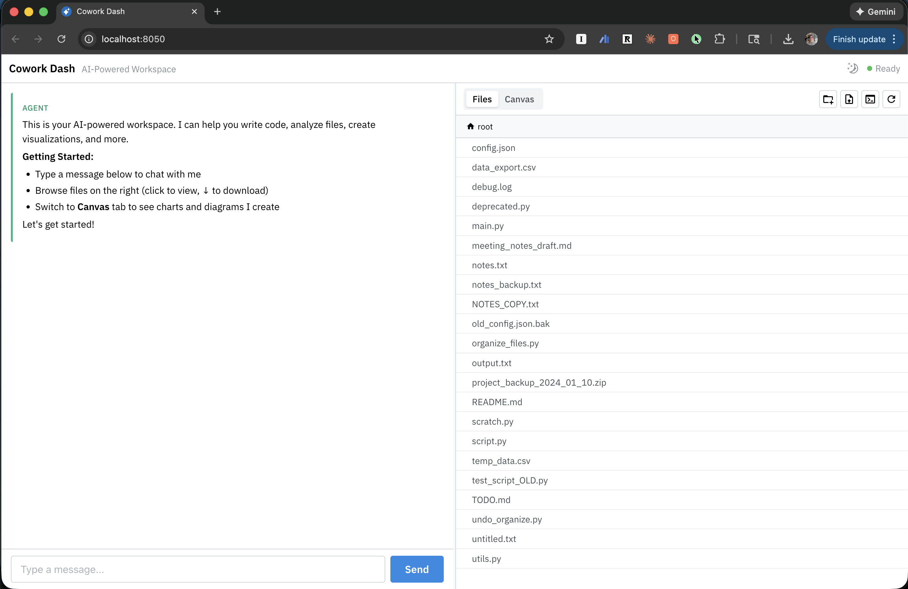
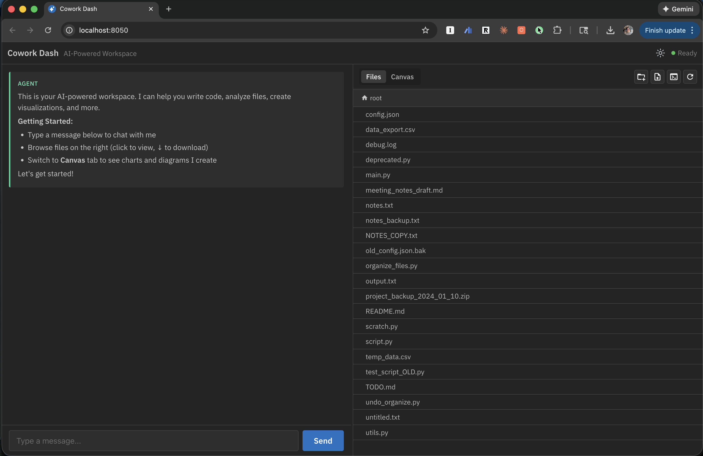

# Cowork Dash

A web interface for AI agent interactions with filesystem workspace, canvas visualization, and real-time streaming.

<p align="center">
  
  
</p>

## Features

- **AI Agent Chat**: Real-time streaming with thinking process and task progress
- **File Browser**: Interactive file tree with lazy loading
- **Canvas**: Visualize DataFrames, Plotly/Matplotlib charts, Mermaid diagrams, images
- **Flexible Configuration**: Environment variables, CLI args, or config file

## Quick Start

### Installation

```bash
# Install via pip (includes DeepAgents)
pip install cowork-dash

# Or run directly with uvx (no installation needed)
export ANTHROPIC_API_KEY="your_anthropic_api_key"
cowork-dash run
```

### Run
After setting up your agent (optional), run the app.
You can also use the default agent by setting ANTHROPIC_API_KEY environment variable.

```bash
# Run with defaults (current directory as workspace, no agent)
export ANTHROPIC_API_KEY="your_anthropic_api_key"
cowork-dash run

# Run with workspace
cowork-dash run --workspace ~/my-workspace

# Run with custom agent (optional)
cowork-dash run --agent my_agent.py:agent

# Using uvx (one-off execution)
uvx cowork-dash run --workspace ~/my-workspace --port 8080
```

Open browser to `http://localhost:8050`

## Configuration

### Priority (highest to lowest)

1. **CLI Arguments** - `--workspace`, `--port`, etc.
2. **Environment Variables** - `DEEPAGENT_*`
3. **Config File** - `config.py` defaults


### CLI Options (all optional)

```bash
cowork-dash run [OPTIONS]

  --workspace PATH        Workspace directory (default: current directory)
  --agent PATH:OBJECT     Point to your Langgraph agent (default: default agent, manual mode)
  --port PORT            Server port (default: 8050)
  --host HOST            Server host (default: localhost)
  --debug                Enable debug mode
  --title TITLE          App title (default: "Cowork Dash")
  --subtitle TEXT        App subtitle (default: "AI-Powered Workspace")
  --welcome-message TEXT Welcome message shown in chat (supports markdown)
```

### Environment Variables (optional)

```bash
export DEEPAGENT_SPEC=my_agent.py:agent         # Set any Langgraph agent
export DEEPAGENT_WORKSPACE_ROOT=/path/to/workspace
export DEEPAGENT_DEBUG=true                     # optional (default: false)
export DEEPAGENT_APP_TITLE="My App"             # optional
export DEEPAGENT_APP_SUBTITLE="Subtitle"        # optional
export DEEPAGENT_WELCOME_MESSAGE="Hello!"       # optional (supports markdown)

cowork-dash run
```

### Python API

```python
from cowork_dash import run_app

# Option 1: Pass agent instance directly (recommended)
from my_agent import MyAgent
agent = MyAgent()
run_app(agent, workspace="~/my-workspace")

# Option 2: Use agent spec
run_app(agent_spec="my_agent.py:agent", workspace="~/my-workspace")

```

## Agent Integration

### Agent Specification

Load agents using `path:object` format:

```bash
# Load from Python file
cowork-dash run --agent agent.py:my_agent

# Absolute path
cowork-dash run --agent /path/to/agent.py:agent_instance
```

### Example Agent Setup

```python
# my_agent.py
import os
from deepagents import create_deep_agent
from deepagents.backends.filesystem import FileSystemBackend

backend = FileSystemBackend(root=os.getenv('DEEPAGENT_WORKSPACE_ROOT', './'))
my_agent = create_deep_agent(..., backend=backend)
```

Then run: `cowork-dash run --agent my_agent.py:my_agent`

## Canvas

The canvas displays agent-created visualizations:

- **DataFrames**: HTML tables
- **Charts**: Plotly, Matplotlib
- **Images**: PNG, JPG, etc.
- **Diagrams**: Mermaid (flowcharts, sequence diagrams)
- **Markdown**: Text and notes

Content auto-saves to `canvas.md` and can be exported or cleared.

## Development

```bash
# Install from source
git clone https://github.com/dkedar7/cowork-dash.git
cd cowork-dash
pip install -e ".[dev]"

# Run tests
pytest

# Build package
python -m build
```

## Requirements

- Python 3.11+
- Dash 2.0+
- dash-mantine-components
- pandas, plotly, matplotlib, Pillow
- python-dotenv
- deepagents

## Links

- **PyPI**: https://pypi.org/project/cowork-dash/
- **GitHub**: https://github.com/dkedar7/cowork-dash
- **Issues**: https://github.com/dkedar7/cowork-dash/issues
